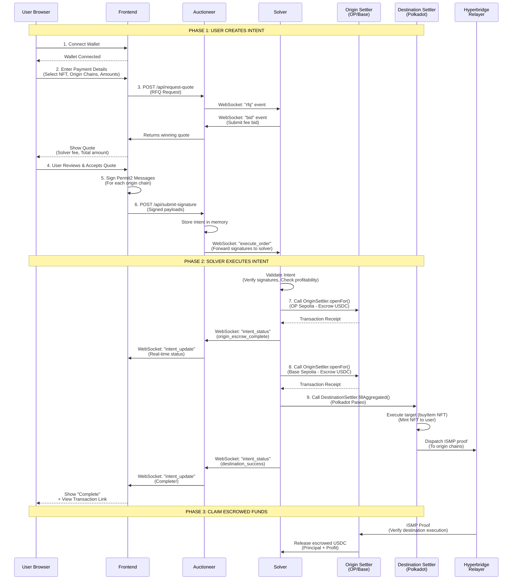
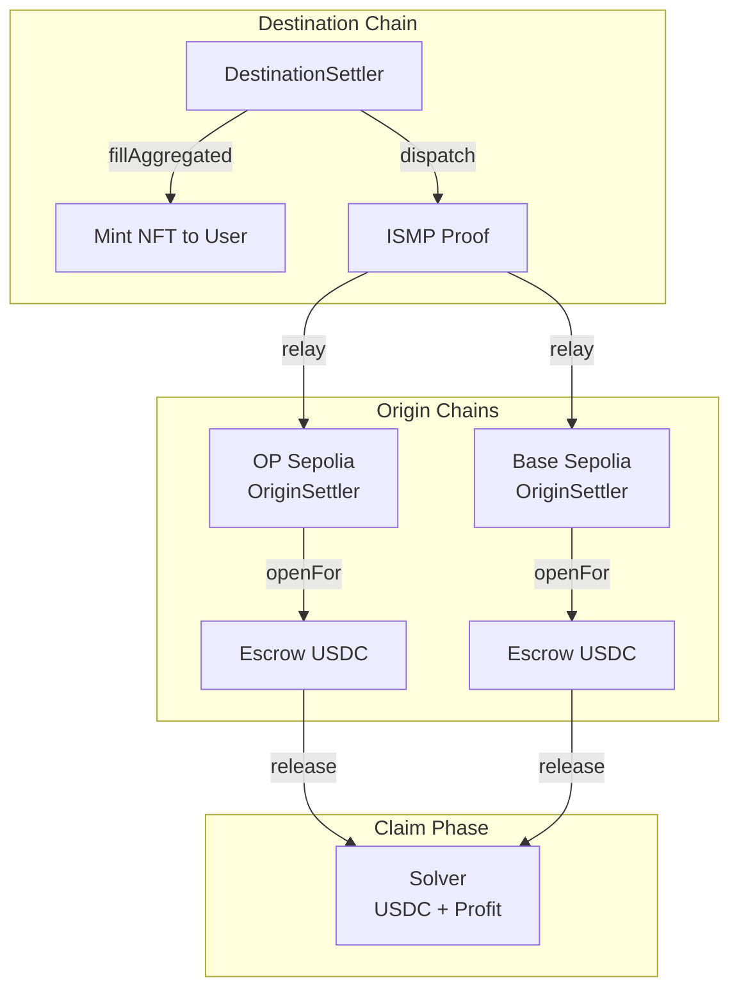
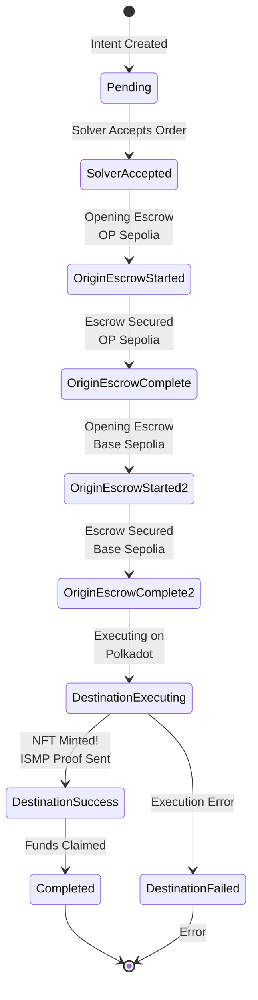

# OmniSpend Developer Guide

Cross-chain intent payments from multiple origin chains to any destination chain using JIT auctions and Hyperbridge ISMP.

## Project Overview

OmniSpend enables users to **pay from everywhere** - combine USDC from multiple chains (OP, Base) to execute transactions on any destination chain (Polkadot). Users sign once, solvers compete in real-time auctions to fill the order profitably.

### Key Features

- **Multi-chain aggregation**: Pay from multiple chains simultaneously
- **Gasless transactions**: Users sign once, solvers pay gas upfront
- **Dutch Auction RFQ**: Solvers bid competitively, fees decay over time
- **Hyperbridge ISMP**: Cryptographically verified cross-chain messaging
- **Universal execution**: Execute any contract call on destination chain

## Repository Structure

```
hackathon/
├── auctioneer/     # Backend RFQ auction server (Node.js/TypeScript)
├── contract/      # Solidity smart contracts (Hardhat)
├── docs/           # Detailed documentation
├── frontend/       # React web application
├── sdk/            # TypeScript SDK for integrations
├── solver/         # Solver bot reference implementation
└── test/           # Integration tests
```

## Architecture

### System Flow



### Contract Interactions



### Intent Status Flow



## Quick Start

### Prerequisites

- Node.js 18+
- npm or yarn
- Git

### 1. Clone and Install

```bash
git clone https://github.com/OmniSpend-Polkadot/payment-sdk.git
cd payment-sdk

# Install root dependencies
npm install

# Install all workspace packages
npm install --workspaces
```

### 2. Configure Environment

```bash
# Copy example env files and configure
cp auctioneer/.env.example auctioneer/.env
cp solver/.env.example solver/.env
```

Required environment variables:

**Auctioneer** (`auctioneer/.env`):
```
PORT=3001
WS_PORT=3002
# RPC endpoints
OP_SEPOLIA_RPC=https://sepolia.optimism.io
BASE_SEPOLIA_RPC=https://sepolia.base.io
POLKADOT_PASEO_RPC=https://pasco.polkadot.io
# Private key for solver coordination (not for funds)
SOLVER_PRIVATE_KEY=0x...
```

**Solver** (`solver/.env`):
```
AUCTIONEER_WS=ws://localhost:3002
OP_SEPOLIA_RPC=https://sepolia.optimism.io
BASE_SEPOLIA_RPC=https://sepolia.base.io
POLKADOT_PASEO_RPC=https://pasco.polkadot.io
# Solver's funded wallet private key
SOLVER_PRIVATE_KEY=0x...
# Solver's USD.h token for destination chain fees
SOLVER_USDH_PRIVATE_KEY=0x...
```

### 3. Deploy Contracts

```bash
cd contract
npm run deploy:testnet
```

See [docs/DEPLOY.md](docs/DEPLOY.md) for detailed deployment instructions.

### 4. Start the Auctioneer

```bash
cd auctioneer
npm run dev
# Server runs on http://localhost:3001
# WebSocket runs on ws://localhost:3002
```

### 5. Start a Solver Bot

```bash
cd solver
npm run demo #simulate bot competition and bot blue is the real solver
```

### 6. Run the Frontend

```bash
cd frontend
npm run dev
# Opens on http://localhost:5173
```

## Running with Docker

```bash
# Start all services
docker-compose up -d

# View logs
docker-compose logs -f auctioneer

# Stop all services
docker-compose down
```

## Development

### Project Scripts

```bash
# Root
npm run build           # Build all packages
npm run test           # Run all tests

# Auctioneer
npm run dev            # Start in development mode
npm run build          # Build TypeScript
npm run start          # Start production server

# Frontend
npm run dev            # Vite dev server
npm run build          # Production build
npm run preview        # Preview production build

# SDK
npm run build          # Build with tsup
npm run test           # Test SDK functions

# Solver
npm run demo
```

### Smart Contract Development

```bash
cd contract

# Compile contracts
npm run compile

# Run tests
npm run test

# Deploy to testnet
npm run deploy:testnet

# Verify on block explorer
npm run verify:testnet
```

## Key Documentation

- [Protocol Flow](docs/PROTOCOL_FLOW.md) - Complete flow from intent to execution
- [Architecture](docs/architecture.md) - System design and component interactions
- [Deployment Guide](docs/DEPLOY.md) - How to deploy contracts
- [SDK Integration](docs/SDK_INTEGRATION.md) - Using the SDK in your project
- [Deployed Addresses](docs/DEPLOYED_ADDRESSES.md) - Contract addresses on testnets

## Supported Chains

| Chain | Chain ID | USDC Address |
|-------|----------|--------------|
| OP Sepolia | 11155420 | `0x5fd84259d66Cd46123540766Be93DFE6D43130D7` |
| Base Sepolia | 84532 | `0x036CbD53842c5426634e7929541eC2318f3dCF7e` |
| Polkadot Paseo | 420420417 | `0x9Dd96D4BC333A4A3Bbe1238C03f28Bf4a9c8aCAb` |

## SDK Usage

Since the SDK is not published to npm, clone and build:

```bash
git clone https://github.com/OmniSpend-Polkadot/payment-sdk.git
cd payment-sdk/sdk
npm install
npm run build
```

Then import from the built output:

```typescript
import { OmniSpend, createNftMintCalldata } from "./path/to/sdk/dist";

// Initialize SDK
const omnispend = new OmniSpend("http://localhost:3001");

// Request quote
const quote = await omnispend.requestQuote(
  userAddress,
  originChains,
  destination
);

// Submit signed signatures
await omnispend.submitSignature(quote.requestId, quote.winner.solverAddress, signatures);
```

See [sdk/README.md](sdk/README.md) for full SDK documentation.

## Contributing

1. Fork the repository
2. Create your feature branch (`git checkout -b feature/amazing-feature`)
3. Commit your changes (`git commit -m 'Add some amazing feature'`)
4. Push to the branch (`git push origin feature/amazing-feature`)
5. Open a Pull Request

## License

MIT
